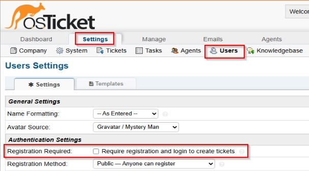

  

<h1>osTicket Post Installation Configuration</h1>
This tutorial outlines the prerequisites and installation of the open-source helpdesk ticketing system osTicket within Azure Virtual Machines. 

<h2></h2>

<h2>Environments and Technologies Used</h2>

- Microsoft Azure (Virtual Machines/Computer)
- Remote Desktop
- Internet Information Services (IIS)

<h2>Operating Systems Used </h2>

- Windows 10</b> (21H2)

<h2>Post-Install Configuration Objectives</h2>

- Configure Roles
- Configure Departments
- Configure Teams
- Configure Agents(Workers)/Users(Customers)
- Configure SLA/Help Topics

<h2>Configuration Steps</h2>

Admin/Analyst Login Page:
http://localhost/osTicket/scp/login.php

End Users osTicket URL:
http://localhost/osTicket 

**Acknowledge Agent Panel vs Admin Panel**
<h3>Agent Panel</h3>

 

<h3>Admin Panel</h3>

<h3>Configure Roles</h3>

First, we need to configure roles for osTicket in order to have grouping permissions. We will only be creating a Supreme Admin this time.

- Make sure you are on the Admin Panel
- Click on Agents tab and then the Roles tab
- Click on "Add New Role"

- Set the name to "Supreme Admin"

- Check on every box on Tickets, Tasks and Knowledgebase
- Click "Add Role" when you are done

<h3>Configure Departments</h3>

We will now add a Departments in order to differentiate which Agents belong where.

- Make sure you are on the Admin Panel
- Click on Agents tab and then the Departments tab
- Click on "Add New Department"

- Set the name to "SysAdmins" and save the Department

<h3>Configure Teams</h3>

Teams allows us to group Agents and show where they belong to.

- Make sure you are on the Admin Panel
- Click on the Agents Tab and then the Teams Tab
- Click on "Add New Team"

- Set the name to "Team A" and then click on "Create Team"

<h3>Allow anyone to create tickets</h3>

Before we go any further, we first need to make sure that the ability for anyone to create tickets is enabled.

- Make sure to be on the Admin Panel
- Click on Settings Tab and then the Users Tab
- Uncheck "Registration Required: Require registration and login to create tickets"

<h3>Configure Agents</h3>

We now need to create the Agent accounts who will solve the tickets.

- Make sure you are on the Admin Panel
- Click on the Agents Tab and then click on "Add New Agent"

Create Jane's Account

(You can set any name you wish. I'm using Jane and John for my lab.)

- Make sure to fill in the Name, Email Address and the Username. (Use any you want)

- Assign Jane's Department and Role to "SysAdmins" and "Supreme Admin"

- Assign Jane to "Team A" and then click on Create

Create John's Account

- Make sure to fill in the Name, Email Address and the Username.

- Assign Jane's Department and Role to "Support" and "View Only" and then click on Create

<h3>Configure Users</h3>

Here, we will add the users who will be creating the tickets.

- Click on the Agent Panel
- Click on Users Tab and then "Add User"

*(I will be using Karen and Ken as my users but you can use any name you want)*

- Fill in the Name and Email Address of the users you're going to add

<h3>Configure SLA</h3>

Tickets need to have SLA in order to determine its severity and amount of time needed for it to be finished.

- CLick on the Admin Panel if you are not on it already
- Click on Manage --> SLA --> "Add New SLA Plan"

- Level 1 (Grace Period: 1 hour, Schedule: 24/7)

- Level 2 (Grace Period: 4 hours, Schedule: 24/7)

- Level 3 (Grace Period: 8 hours, Business Hours)

<h3>Configure Help Topics</h3>

Finally, We will configure the Help Topics so that our users will be able to assign the correct ticket to it.

- CLick on the Admin Panel if you are not on it already
- Click on Manage --> Help Topics --> "Add New Help Topic"

<h4>Business Critical Outage</h4>

<h4>Personal Computer Issues</h4>

<h4>Equipment Request</h4>

<h4>Password Reset</h4>

<h4>Other</h4>

<h2>Finish</h2>
Congratulations! That concludes all the necessary configuration needed in order to get osTicket ready to work.
